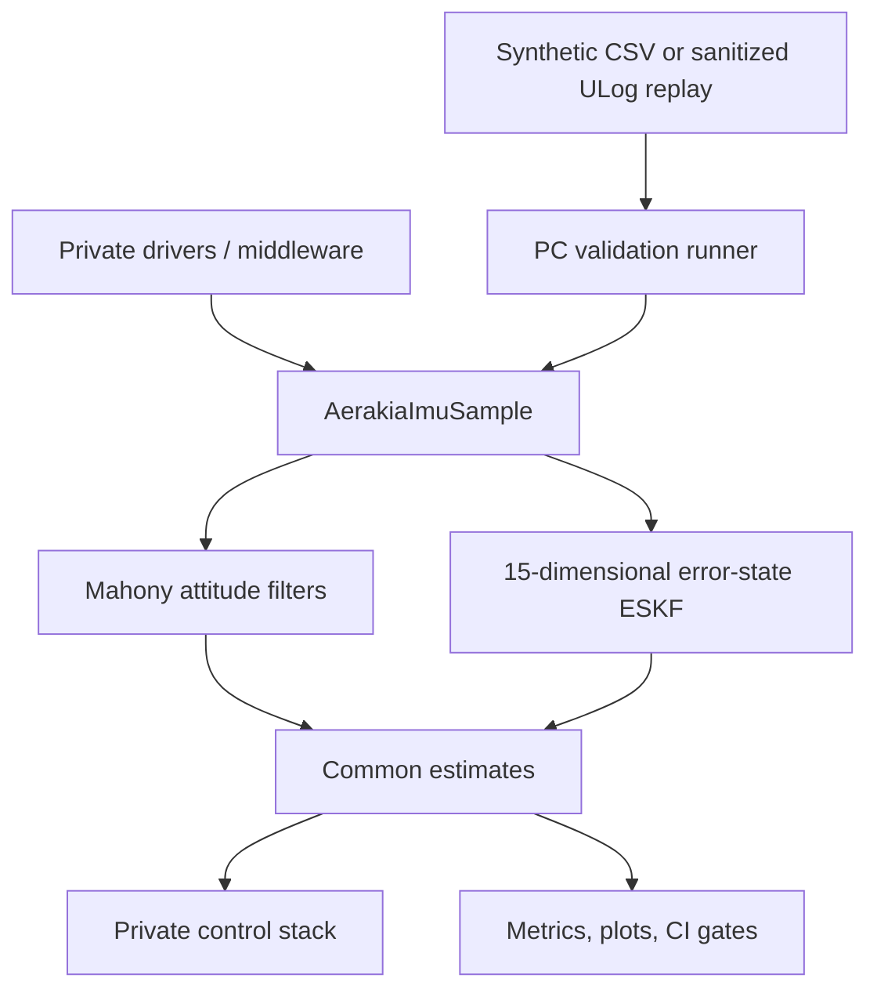

# Architecture

The public API is the seam between private hardware integration and portable estimation. PC replay deliberately enters through the same seam.

## Dependency direction

- `include/aerakia/types.h` defines measurement and attitude contracts.
- Mahony and the ESKF adapter depend only on those contracts and portable math.
- The private target adapter depends on both its drivers and Aerakia, never the reverse.
- The PC runner links the identical C library used by the target.
- Python generates datasets and analyzes outputs; it does not reimplement the estimator.

This prevents a demonstration from accidentally validating a Python approximation while the embedded product runs different C code.

## State model choice

The current nominal state has 16 stored components: position (3), velocity (3), body-to-NED quaternion (4), accelerometer bias (3), and gyroscope bias (3). Its local error state has 15 dimensions because quaternion attitude error is represented by a three-vector.

Solà's general formulation can add a three-component gravity state, yielding a 19-component nominal state and an 18-dimensional error state. Aerakia currently fixes gravity to local NED `[0, 0, g]`. That is the smaller, observable model for the current flight-log evidence; adding weakly observable gravity states would not solve magnetic-heading failures.

Changing test location or flying over a large area is handled first by updating the local navigation origin, gravity model, magnetic reference, and trusted heading source. A dynamic gravity state should be added only when long-range/high-altitude evidence shows the fixed local model is the limiting error source.
