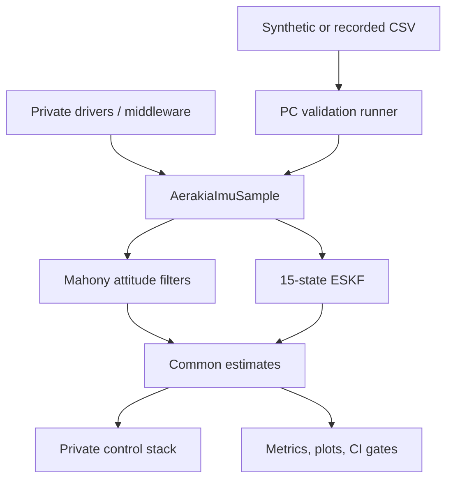

# Architecture

The public API is the seam between private hardware integration and portable estimation. PC replay deliberately enters through the same seam.

## Dependency direction

- `include/aerakia/types.h` defines measurement and attitude contracts.
- Mahony and the ESKF adapter depend only on those contracts and portable math.
- The private target adapter depends on both its drivers and Aerakia, never the reverse.
- The PC runner links the identical C library used by the target.
- Python generates datasets and analyzes outputs; it does not reimplement the estimator.

This prevents a demonstration from accidentally validating a Python approximation while the embedded product runs different C code.
