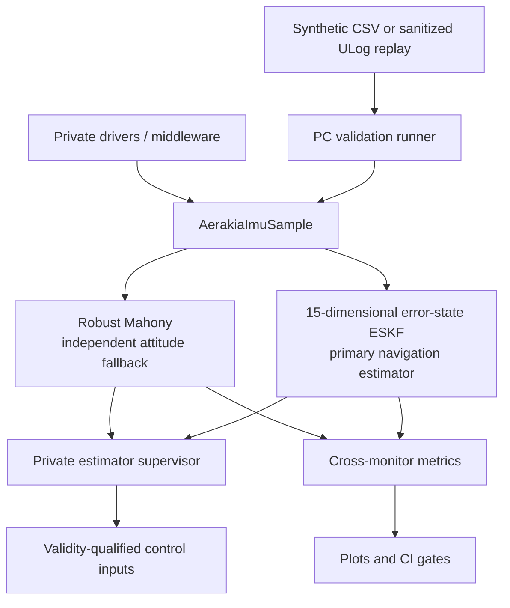

# Architecture

The public API is the seam between private hardware integration and portable estimation. PC replay deliberately enters through the same seam.

## Dependency direction

- `include/aerakia/types.h` defines measurement and attitude contracts.
- Mahony and the ESKF adapter depend only on those contracts and portable math.
- The optional barometer source supervisor is a causal pre-fusion guard; it does not select FCOne
  sensors, switch estimator lanes, or modify the ESKF internally. Its two-stage evaluate/commit
  contract advances the fused residual baseline only after core acceptance; timestamp/freeze/fault
  classification history advances during evaluation. Jump-latch recovery requires a separately
  authorized reference and a return to the old residual basin.
- The private target adapter depends on both its drivers and Aerakia, never the reverse.
- The PC runner links the identical C library used by the target.
- Python generates datasets and analyzes outputs; it does not reimplement the estimator.

This prevents a demonstration from accidentally validating a Python approximation while the embedded product runs different C code.

## Estimator roles

The 15-error-state ESKF is the primary flight estimator. It owns the qualified attitude,
velocity, position, IMU-bias, covariance, and aiding-health outputs used by the navigation and
control stack.

Robust Mahony is an independently configured attitude fallback and cross-monitor. It can preserve
a bounded attitude output when the ESKF is not usable, and its disagreement with the ESKF is useful
diagnostic evidence. It does not estimate velocity, position, full bias covariance, or navigation
integrity, so it is not an equivalent navigation backup. Standard Mahony remains a validation
baseline and is not the planned deployed fallback.

Mode selection belongs to the private FCOne estimator supervisor. The public library exposes
algorithm state and health evidence but does not silently switch control sources or copy Mahony
attitude into the ESKF. See [Estimator supervision](estimator-supervision.md).

The same boundary applies to barometer redundancy. Public validation may run raw, supervised, and
barometer-free ESKF lanes in parallel, but FCOne owns the active-lane mux and controller reset
deltas. A fault latch cannot sanitize a lane that already fused bad measurements; failover must use
a separately propagated, uncontaminated state and covariance. The current PC mux switches only
vertical output fields and is explicitly an upper bound; executable full-state/covariance transfer
and reset semantics remain private FCOne work.

For a state-by-state and capability comparison with PX4 EKF2, including the IMU-only navigation
boundary, see [PX4 EKF2 comparison](px4-ekf2-comparison.md).

## State model choice

The current nominal state has 16 stored components: position (3), velocity (3), body-to-NED quaternion (4), accelerometer bias (3), and gyroscope bias (3). Its local error state has 15 dimensions because quaternion attitude error is represented by a three-vector.

Solà's general formulation can add a three-component gravity state, yielding a 19-component nominal state and an 18-dimensional error state. Aerakia currently fixes gravity to local NED `[0, 0, g]`. That is the smaller, observable model for the current flight-log evidence; adding weakly observable gravity states would not solve magnetic-heading failures.

Changing test location or flying over a large area is handled first by updating the local navigation origin, gravity model, magnetic reference, and trusted heading source. A dynamic gravity state should be added only when long-range/high-altitude evidence shows the fixed local model is the limiting error source.
